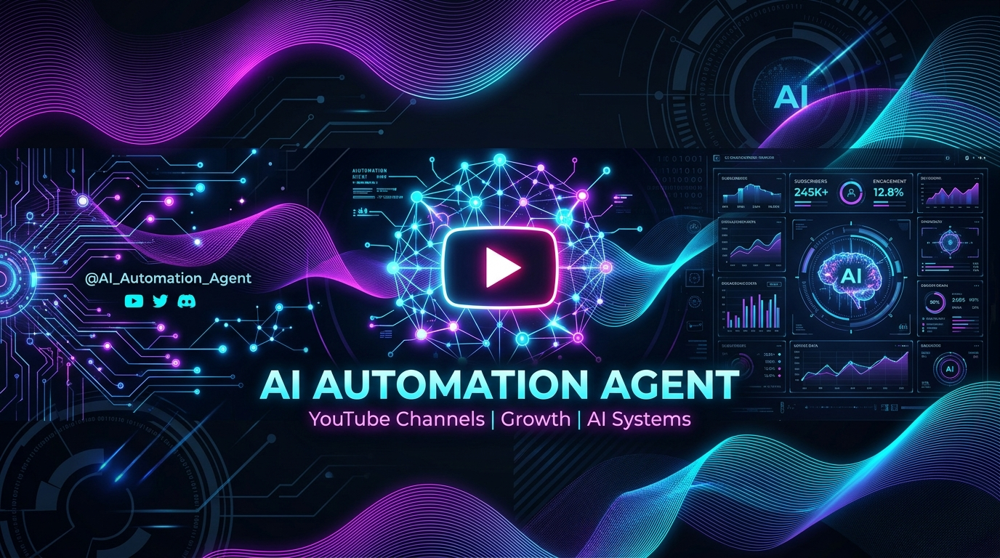

<p align="center">
  
</p>

<h1 align="center">YouTube Automation Agent</h1>

<p align="center">
  <b>The open-source AI agent that runs a YouTube channel end to end.</b>
</p>

<p align="center">
  <a href="https://github.com/ermradulsharma/youtube-automation-agent/actions/workflows/ci.yml"></a>
  <a href="LICENSE"></a>
  <a href="package.json"></a>
  <a href="https://github.com/ermradulsharma/youtube-automation-agent/stargazers"></a>
  <a href="https://github.com/ermradulsharma/youtube-automation-agent/network/members"></a>
</p>

---

## 📌 Overview

**YouTube Automation Agent** is a self-hosted, approval-first, multi-agent AI system designed to fully automate YouTube channel operations. From initial trend research and scriptwriting to AI video assembly, SEO optimization, thumbnail generation, scheduling, and analytics feedback—every step is handled by specialized AI agents.

```
Research Topics ➔ Write Scripts ➔ Generate Narration & Visuals ➔ Assemble Video ➔ Optimize SEO ➔ Human Review ➔ Schedule & Publish ➔ Analyze Performance
```

---

## ✨ Key Features

- **🤖 Autonomous Multi-Agent Core**: 7 specialized agents (Strategy, Scriptwriting, Visuals/Thumbnails, SEO, Production, Publishing, Analytics) coordinate via a central orchestrator.
- **🎬 Multi-Provider AI Video Generation**: Seamlessly route video prompts to Seedance, MiniMax H3, Gemini Omni Flash, Kling, Wan, or local FFmpeg animation fallback.
- **🎙️ Advanced TTS & Narration**: Native support for ElevenLabs v3, OpenAI TTS, Google Gemini TTS, and Microsoft Cognitive Services.
- **🎨 Automated Thumbnail Designer**: Generates eye-catching 16:9 thumbnail concepts with custom overlay typography using Sharp and AI image models.
- **📱 Shorts Repurposing Studio**: Converts approved long-form videos into 9:16 Shorts with smart layout choices (blurred background, center crop, stacked) and local subtitle burning.
- **🔍 Research & Provenance Tracking**: Tracks exact reference sources, verifies facts against real data, and embeds compliance disclosures in YouTube upload metadata.
- **📊 Scene-Aware Retention Engine**: Analyzes YouTube retention curves down to specific video scenes, providing actionable feedback for future content runs.
- **🛡️ Quality & Approval Gates**: Self-hosted dashboard ensures no video goes live without passing automated checks or human approval.

---

## 🏗️ System Architecture & Specialized Agents

| Agent | Responsibility |
| :--- | :--- |
| **Content Strategy Agent** | Researches trending topics, defines video pillars, and constructs content calendars. |
| **Script Writer Agent** | Drafts engaging, scene-structured scripts with visual prompts and provenance citations. |
| **Thumbnail Designer Agent** | Creates high-CTR 1280x720 thumbnails with bold text overlays. |
| **SEO Optimizer Agent** | Generates click-worthy titles, description tags, and hashtag strategies. |
| **Production Management Agent** | Coordinates video rendering, TTS voiceovers, scene assembly, and local FFmpeg processing. |
| **Publishing Scheduling Agent** | Interacts with YouTube Data API v3 for scheduled or immediate uploads. |
| **Analytics Optimization Agent** | Monitors channel metrics, audience retention, and feeds insights back into future video runs. |

---

## 🚀 Quick Start

### Prerequisites

- **Node.js**: `>= 18.0.0`
- **FFmpeg**: Installed on system path (or automatically bundled via fallback)
- **YouTube API Credentials**: OAuth 2.0 Client ID for channel management

### Installation

1. **Clone the repository**:
   ```bash
   git clone https://github.com/ermradulsharma/youtube-automation-agent.git
   cd youtube-automation-agent
   ```

2. **Install dependencies**:
   ```bash
   npm install
   ```

3. **Run Interactive Walkthrough Setup**:
   ```bash
   npm run walkthrough
   ```
   *This launches an interactive setup guide explaining API keys, testing credentials, and authorizing YouTube access.*

4. **Start the Web Dashboard**:
   ```bash
   npm start
   ```
   Open `http://localhost:3456` in your browser.

---

## ⚙️ Configuration & Environment Settings

Copy `.env.example` to create your local `.env` configuration:

```bash
cp .env.example .env
```

### Essential Environment Variables

```env
# Server & Environment
PORT=3456
NODE_ENV=development

# AI API Providers (Any one primary provider is sufficient)
OPENAI_API_KEY=your_openai_key
GEMINI_API_KEY=your_gemini_key
OPENROUTER_API_KEY=your_openrouter_key

# Voice / TTS Providers
ELEVENLABS_API_KEY=your_elevenlabs_key

# YouTube Integration
YOUTUBE_CLIENT_ID=your_client_id.apps.googleusercontent.com
YOUTUBE_CLIENT_SECRET=your_client_secret
YOUTUBE_REDIRECT_URI=http://localhost:3456/oauth2callback
```

---

## 📜 NPM Scripts Reference

| Command | Description |
| :--- | :--- |
| `npm start` | Starts the main agent orchestrator and web dashboard (`localhost:3456`). |
| `npm run setup` | Launches quick console setup wizard for credentials. |
| `npm run walkthrough` | Step-by-step onboarding walkthrough for new users. |
| `npm test` | Runs the comprehensive automated test suite (12+ system tests). |
| `npm run lint` | Code quality verification via ESLint. |
| `npm run scheduler` | Runs automated daily posting cron tasks. |

---

## 📂 Project Layout

```
youtube-automation-agent/
├── agents/                  # Specialized AI Agent modules
│   ├── analytics-optimization-agent.js
│   ├── content-strategy-agent.js
│   ├── production-management-agent.js
│   ├── publishing-scheduling-agent.js
│   ├── script-writer-agent.js
│   ├── seo-optimizer-agent.js
│   └── thumbnail-designer-agent.js
├── assets/                  # Public assets & banners
│   └── banner.jpg
├── config/                  # Provider and OAuth credentials (git-ignored)
├── dashboard/               # Web UI (HTML/CSS/JS)
├── database/                # SQLite local storage
├── schedules/               # Daily cron automation schedules
├── utils/                   # Video rendering, FFmpeg, AI services & helpers
├── index.js                 # Central Agent Orchestrator & Server entrypoint
├── package.json
└── README.md
```

---

## 🤝 Contributing

Contributions are welcome! Please follow these guidelines:

1. **One Concern per PR**: Keep pull requests focused and modular.
2. **Pass Tests & Lint**: Run `npm run lint` and `npm test` before submitting.
3. **No Lockfile Churn**: Do not modify `package-lock.json` unless adding a new dependency.

Refer to [CONTRIBUTING.md](CONTRIBUTING.md) for detailed rules.

---

## 📄 License

This project is licensed under the **MIT License**. See the [LICENSE](LICENSE) file for details.

---

## 👤 Author & Maintainer

Developed and maintained by **[@ermradulsharma](https://github.com/ermradulsharma)**.

- **GitHub**: [github.com/ermradulsharma](https://github.com/ermradulsharma)
- **Repository**: [ermradulsharma/youtube-automation-agent](https://github.com/ermradulsharma/youtube-automation-agent)

---

<p align="center">
  <sub>Built with ❤️ for AI Automation & YouTube Content Creators</sub>
</p>
